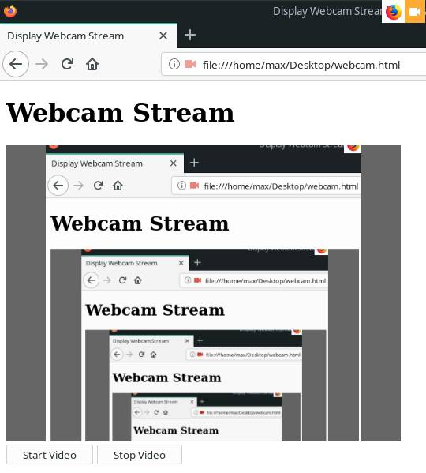

# Javascript Webcam Demo

Get Webcam frames in **javascript** and Watch Webcam Stream in video tag.

[Try it](https://basemax.github.io/JavascriptWebcamDemo/)

[](https://basemax.github.io/JavascriptWebcamDemo/)

Some of the code is taken from sources on the Internet. (stop function)

### I not have a webcam, So how to test?

Unfortunately, I do not have a webcam or microphone in my personal system.
So you might be wondering how I tested the script?

Given that my operating system is **Linux**. I activated the `v4l2loopback` module.
And with the help of **ffmpeg** I simulated a virtual webcam.

```
$ sudo modprobe v4l2loopback
$ ffmpeg -f x11grab -r 15 -s 512x512 -i :0.0+0,0 -vcodec rawvideo -pix_fmt yuv420p -threads 0 -f v4l2 /dev/video0
$ v4l2-ctl --list-devices
$ ffplay /dev/video0
```

---------

# Max Base

My nickname is Max, Programming language developer, Full-stack programmer. I love computer scientists, researchers, and compilers.

## Asrez Team

A team includes some programmer, developer, designer, researcher(s) especially Max Base.

[Asrez Team](https://www.asrez.com/)
